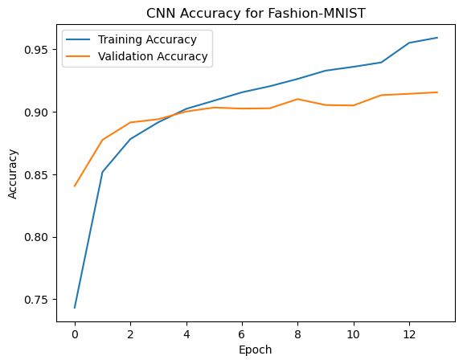
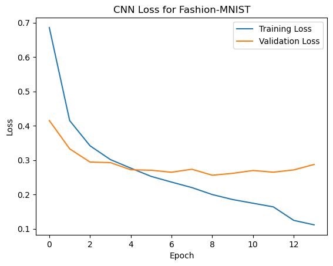
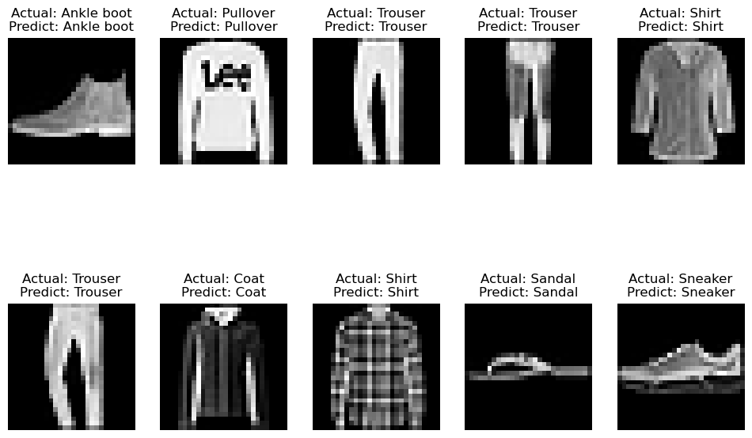

# 👚 Fashion-MNIST Image Classification with CNN

A Convolutional Neural Network (CNN) built to classify images from the Fashion-MNIST dataset into 10 clothing categories.

Part of a personal deep learning study project.

---

## 🗂️ Dataset

- **Dataset:** [Fashion-MNIST](https://github.com/zalandoresearch/fashion-mnist)
- **Image size:** 28×28 pixels, grayscale
- **Classes:**  
0: T-shirt/top   
1: Trouser  
2: Pullover  
3: Dress  
4: Coat  
5: Sandal  
6: Shirt  
7: Sneaker  
8: Bag  
9: Ankle boot  

---

## 🧠 Model Details

- **Architecture:** CNN with 3 Conv2D layers, max pooling, dense layers & dropout
- **Input shape:** (28, 28, 1)
- **Output classes:** 10
- **Optimizer:** Adam (lr=0.001)
- **Loss:** Categorical Cross-Entropy
- **Epochs:** 30 (with early stopping & learning rate scheduling)
- **Validation split:** 20%
- **Total parameters:** ~422,000

---

## 📊 Training Results

| Metric               | Result  |
|---------------------:|-------:|
| Final validation acc | ~91%   |
| Test accuracy       | ~90%   |

<p float="left">


</p>

---

## 🧪 Evaluation

After training, the model was evaluated with:

### CNN_mnist Classification Report:
```bash 
               precision    recall  f1-score   support

           0       0.87      0.83      0.85      1000
           1       0.99      0.98      0.99      1000
           2       0.81      0.89      0.85      1000
           3       0.89      0.93      0.91      1000
           4       0.86      0.81      0.84      1000
           5       0.98      0.98      0.98      1000
           6       0.72      0.71      0.71      1000
           7       0.96      0.95      0.96      1000
           8       0.98      0.97      0.98      1000
           9       0.96      0.97      0.97      1000

    accuracy                           0.90     10000
   macro avg       0.90      0.90      0.90     10000
weighted avg       0.90      0.90      0.90     10000
```

### Confusion Matrix:
```bash 
 [[831   0  16  23   2   0 123   0   5   0]
 [  1 978   0  14   2   0   4   0   1   0]
 [ 16   0 891  10  39   0  43   0   1   0]
 [ 12   4   8 932  16   0  27   0   1   0]
 [  1   1  82  36 811   0  69   0   0   0]
 [  0   0   0   0   0 983   0  11   0   6]
...
 [  0   0   0   0   0  11   0 954   0  35]
 [  2   1   6   4   5   1   6   3 972   0]
 [  1   0   0   0   0   4   0  24   0 971]]
Accuracy: 0.903
```
---

## 🖼️ Sample Predictions

Below are 10 test images showing actual & predicted labels:

<p float="left">
  
</p>

---
## ⚙️ How to Run

```bash
pip install -r requirements.txt
python Fashion-MNIST-CNN.ipynb
```
---
## License
This project is licensed under the Creative Commons Attribution 4.0 International License (CC BY 4.0) — see the LICENSE file for details.
Please credit Seda Yalçin when using or sharing this work.
